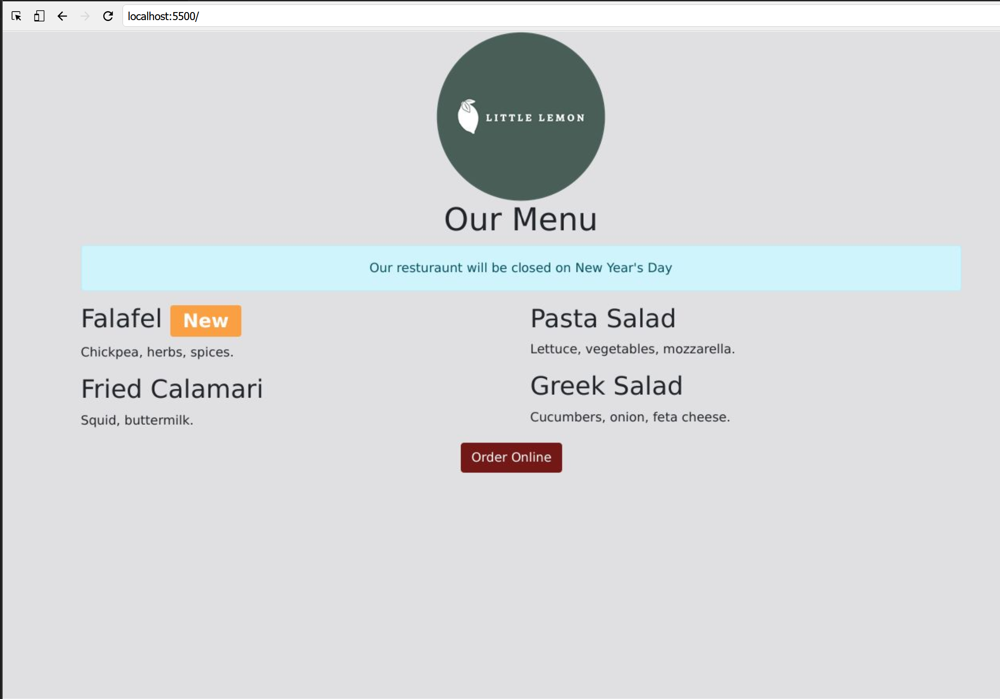

```html
<!-- Little Lemon Website - Bootstrap Components Exercise -->

# Little Lemon Website - Bootstrap Components Exercise

## Goal

I've successfully updated the Little Lemon website to use Bootstrap Components.

## Objectives

1. Added a Badge component to the page to notify customers of the new falafel dish.
2. Added an Alert component to the page to notify customers that the restaurant will be closed on New Year's Day.
3. Added a Button component to the page with the text Order Online.

## Instructions

### Step 1: Open index.html

### Step 2: Added another div element below the Our Menu text-center div element.

```html
<div class="row">
    <div class="col-12">
        <div class="text-center">
            <h1>Our Menu</h1>
        </div>
        <!-- New div element goes here -->
    </div>
</div>
```

### Step 3: Added a class attribute to the element with the value alert alert-info.

### Step 4: Added a role attribute to the element with the value alert.

### Step 5: Added the message Our restaurant will be closed on New Year's Day, inside the div element.

```html
<div class="row">
    <div class="col-12">
        <div class="text-center">
            <h1>Our Menu</h1>
        </div>
        <div class="alert alert-info" role="alert">
            Our restaurant will be closed on New Year's Day.
        </div>
    </div>
</div>
```

### Step 6: Added a span element inside the Falafel h2 element, before the closing h2 tag.

### Step 7: Added a class attribute to the span element, with the value badge bg-secondary.

```html
<h2>Falafel <span class="badge bg-secondary">New</span></h2>
```

### Step 8: Added another div element after the last row element.

### Step 9: Added a class attribute with the value row to the div element.

### Step 10: Added a div element inside the row div element.

### Step 11: Added a class attribute with the value col-12 to the div element.

### Step 12: Added another div element inside the col-12 div element.

### Step 13: Added a class attribute with the value text-center to the div element.

### Step 14: Added a button element inside the text-center div element.

### Step 15: Added a type attribute with the value button.

### Step 16: Added a class attribute with the value btn btn-primary.

### Step 17: Added the text Order Online inside the button element.

```html
<div class="row">
    <div class="col-12">
        <div class="text-center">
            <button type="button" class="btn btn-primary">Order Online</button>
        </div>
    </div>
</div>
```

I've successfully completed these steps, and now my Little Lemon website features Bootstrap Components.
```


```