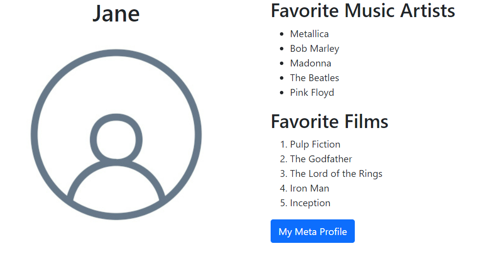

# **About the Ungraded Lab: Improve your Bio page with Bootstrap**
In this Ungraded Lab, I updated my biographical page from Week 2 - Introduction to HTML5 and CSS to use Bootstrap.

The expected outcome was a two-column biographical page with my name and a photo in the left column and my favorite music artists and films in the right column.

The image below shows how my page should look once I finish the assessment.

